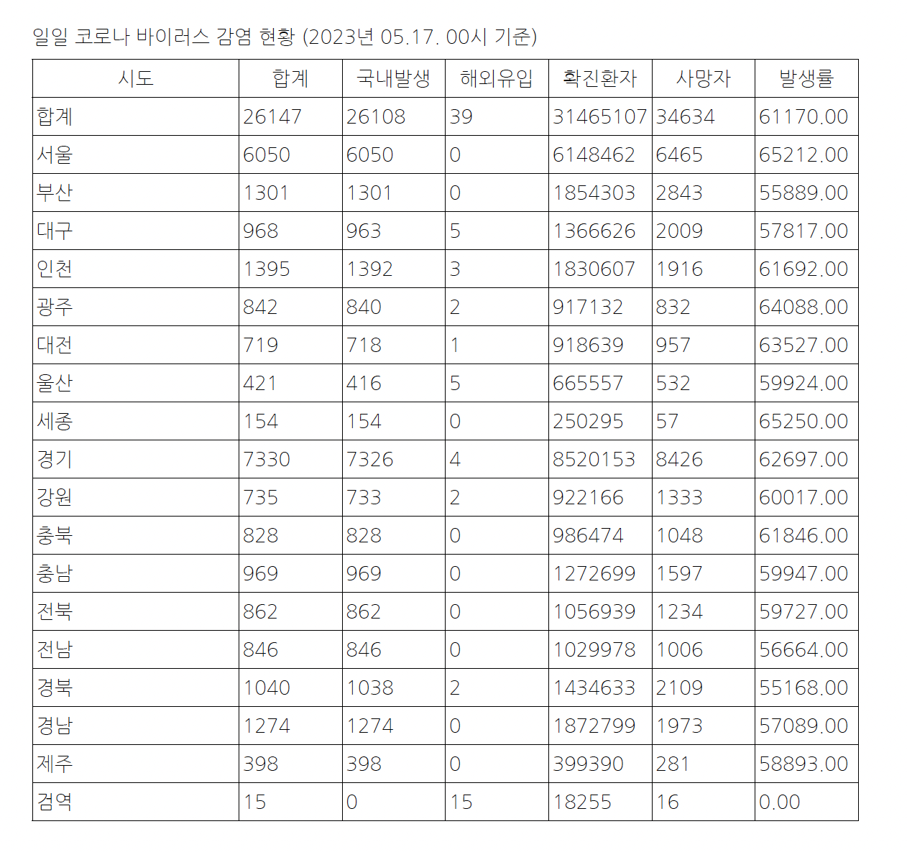
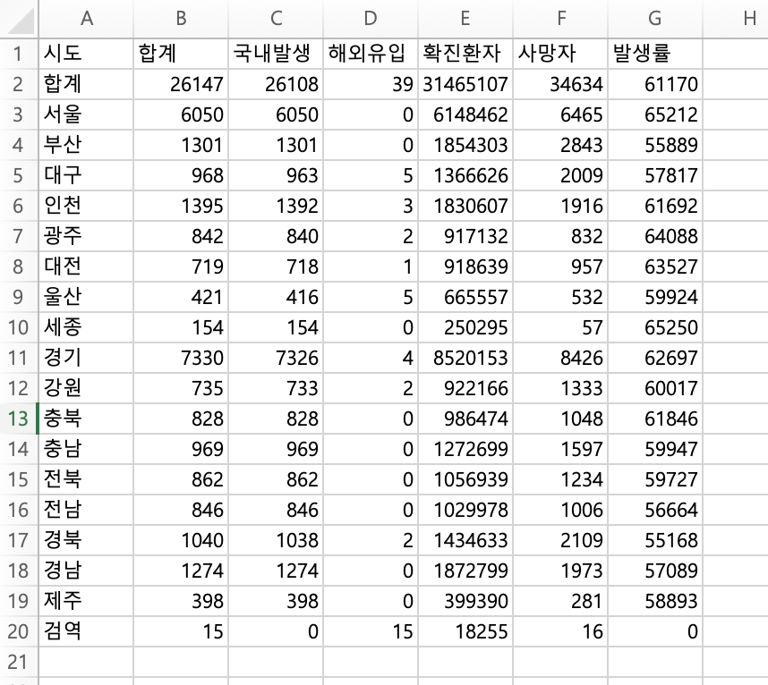

## 크롤링하여 코로나 현황 파일 저장
- jsoup 라이브러리를 사용하여 웹페이지 HTML 문서 파싱
- itextpdf 라이브러리를 사용하여 PDF파일로 저장
- poi 라이브러리를 사용하여 xlsx파일로 저장

---

````
일일 코로나 바이러스 감염 현황 (2023년 05.17. 00시 기준)
시도 | 합계 | 국내발생 | 해외유입 | 확진환자 | 사망자 | 발생률
CovidStatus{region='합계', total=26147, domestic=26108, abroad=39, confirmed=31465107, deaths=34634, rate=61170.0}
CovidStatus{region='서울', total=6050, domestic=6050, abroad=0, confirmed=6148462, deaths=6465, rate=65212.0}
CovidStatus{region='부산', total=1301, domestic=1301, abroad=0, confirmed=1854303, deaths=2843, rate=55889.0}
CovidStatus{region='대구', total=968, domestic=963, abroad=5, confirmed=1366626, deaths=2009, rate=57817.0}
CovidStatus{region='인천', total=1395, domestic=1392, abroad=3, confirmed=1830607, deaths=1916, rate=61692.0}
CovidStatus{region='광주', total=842, domestic=840, abroad=2, confirmed=917132, deaths=832, rate=64088.0}
CovidStatus{region='대전', total=719, domestic=718, abroad=1, confirmed=918639, deaths=957, rate=63527.0}
CovidStatus{region='울산', total=421, domestic=416, abroad=5, confirmed=665557, deaths=532, rate=59924.0}
CovidStatus{region='세종', total=154, domestic=154, abroad=0, confirmed=250295, deaths=57, rate=65250.0}
CovidStatus{region='경기', total=7330, domestic=7326, abroad=4, confirmed=8520153, deaths=8426, rate=62697.0}
CovidStatus{region='강원', total=735, domestic=733, abroad=2, confirmed=922166, deaths=1333, rate=60017.0}
CovidStatus{region='충북', total=828, domestic=828, abroad=0, confirmed=986474, deaths=1048, rate=61846.0}
CovidStatus{region='충남', total=969, domestic=969, abroad=0, confirmed=1272699, deaths=1597, rate=59947.0}
CovidStatus{region='전북', total=862, domestic=862, abroad=0, confirmed=1056939, deaths=1234, rate=59727.0}
CovidStatus{region='전남', total=846, domestic=846, abroad=0, confirmed=1029978, deaths=1006, rate=56664.0}
CovidStatus{region='경북', total=1040, domestic=1038, abroad=2, confirmed=1434633, deaths=2109, rate=55168.0}
CovidStatus{region='경남', total=1274, domestic=1274, abroad=0, confirmed=1872799, deaths=1973, rate=57089.0}
CovidStatus{region='제주', total=398, domestic=398, abroad=0, confirmed=399390, deaths=281, rate=58893.0}
CovidStatus{region='검역', total=15, domestic=0, abroad=15, confirmed=18255, deaths=16, rate=0.0}
엑셀 파일로 저장 완료: covid_status_2023년_05.17._00시_기준.xlsx
PDF 파일로 저장 완료: covid_status_2023년_05.17._00시_기준.pdf
````


